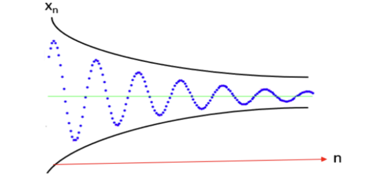

# Quantum Computing

## Lesson 1: Linear Algebra for Quantum Computing

### Matrices

#### Types of matrices

- Column (one column matrix)
- Row (one row matrix)
- Square matrix (rows=columns)
- Equal matrices – two matrices considered equal if they have same dimensions & corresponding elements are equal
- Zero matrix – contains all 0s
- Identity matrix – multiplying a matrix by its identity matrix leaves it unchanged
  - to create an identity matrix just have all the elements along the main diagonal set to 1 and rest to 0
- Vector - either a single column or a single row
  - Vector length – computed with Pythagorean theorem (a^2 + b^2 = c^2)
    - $|| vector || = sqrt( x2 + y2 + … n^2 )$
    - Consider the vector [2, 3, 4]; x = 1, y = 3; so length: sqrt (4+9+16) = 5.38
    - A vector's nonnegative length is called the **norm** of the vector. Given vector v, this is written as ||v||
    - $|| v || = 1 \implies \text{v is a unit vector}$

#### Operations, Properties of Matrices

- Addition & subtraction – element-wise
- Matrix-Matrix Multiplication - multiply each row by each column
  - A x B -> number of columns in A must = # rows in B (inner dimensions must match); output dimensionality is # rows in A by # columns in B (i.e. outer dimensions of product matrices)
  - NOT COMMUTATIVE. Multiplication only commutative if A and B are both scalar values.
- Scalar-Matrix Multiplication - multiply each element in matrix by scalar
- Transposition – reverse order of rows & columns.
  - $(A^T)^T = A$ - transposing a transposition gives original matrix
  - $(cA)^T = cA^T$ - transposing the product of a scalar and a matrix A is the same as the multiplying the constant by the transposition of A
  - $(AB)^T = B^TA^T$ - Multiplying A by B and then transposing the product is equal to B transposed multiplied by A transposed
  - $(A+B)^T = A^T + B^T$ - transposing the sum of two equal-dimensioned matrices is the same as the sum of the individual transpositions
  - $S^T = S$ - if a **square** matrix is equal to its transpose, it's a **symmetric matrix**
- Submatrix – any portion of a matrix that remains after deleting any number of rows or coumns
- Determinant - the determinant of a matrix $A$ is denoted by $|A|$. Example in a generic form:
  - (2)(2) - (3)(1) = 1
  - Non-square matrices do not have determinants
  - The determinant of any square matrix A is a scalar, denoted $det(A)$
  - For 3x3 Matrices
    - Laplace Formula
    - Leibniz Formula
    - Sarrus' scheme
  - 
  - What are they for?
    - Finding eigenvalues and eigenvectors
    - Determining if the matrix has an inverse
    - Determining whether system of n equations in n unknowns has a solution
- Unimodular matrices
  - also used in some lattice-based algorithms. A **unimodular matrix** is a **square matrix** of integers with a **determinnat of plus or minus 1**. Recall that a **determinant** is a value computed from the elements of a square matrix, denoted with $det(A) = |A|$
- Cyclic matrices
  - Cyclic lattices (lattice=matrix) are also used in some cryptographic applications. A cyclic lattice is a lattice that is closed under a **rotational shift operator**.
    - for a lattice L: $L \subseteq Z^n$ is cyclic if $\forall{x} \in L: rot(x) \in L$
    - In English: a matrix L that is a subset of the integers Z is cyclic if for all x in the matrix, x is still in the matrix when rotated

#### Vectors, Vector Spaces

- Spanning the Vector Space
  - A set of vectors $A_1, A_2, ... A_n$ is said to span a vector space $V$ if they are all in $V$ and every vector in $V$ can be expressed as a linear combination of the $A_1, A_2, ... A_n$ vectors.
  - Normally one will **omit the zero vector** as it does not really add anything to the definition
- Linear Dependence & Independence
  - A set of vectors $(V_1, V_2, ... V_n)$ are said to be **linearly dependent** if there is a set of $k_i$, not all zero, such that $k_1V_1 + k_2V_2 + ... + k_nV_n = 0$. If that is NOT the case, the vectors are **linearly independent**.
  - A **basis** for a **vector space** is a set of linearly independent vectors. Consider the following:
    - 
- Orthonormal Basis
  - Basis: a **space** is totally defined by a set of vectors - **any point is a linear combination of the basis**.
  - Ortho-normal: orthogonal + normal
  - Orthogonal: dot product is 0
  - Normal: Magnitude is 1.
  - 
- Euclidean Space
  - Space of classical geometry; _initially_ this space was limited to 3-dimensional space.
  - Cartesian coordinates invented by Rene Descartes in 17th century are used in Euclidean space.
  - In 19th century, Ludwig Schlafi **extended** Euclidean space to include **n dimensions**
    - Schlafi also worked a lot with **polytypes**, which are **analogues of traditional Plutonic solids with more dimensions**.
- Hilbert Spaces
  - Generalization of Euclidean space
  - **Any dimensions**, **infinite or finite**
  - Can be **real or complex**. Every inner product gives rise to a **norm**. Remember: **nonnegative vector length = norm of vector**
  - If space is complete with respect to that norm, it is a Hilbert space.
    - Deeper explanation: **completeness** means every Cauchy sequence of elements in that space converges to an element in this space. What is a **Cauchy sequence?** They're named after **Agustin-Louis Cauchy; pronounched koh-shee. They are sequences whose elements become arbitrarily close to each other as the sequence progresses.**
      - Example of a Cauchy sequence: $a_n = \frac{1}{2^N}$
      - Select any $i > 0$. Now choose an N such that $\frac{1}{2^N} < i$. Then, consider any $m$ and $n > N$. Thus,
      - $|a_n - a_m| = |\frac{1}{2^n} - \frac{1}{2^m}| \leq \frac{1}{2^n} + \frac{1}{a^m} \leq \frac{1}{2^N} + \frac{1}{2^N} = i$
    - 
- Vector operations
  - Addition & subtraction - element-wise; vectors must be same dimensions
  - What does sum of vectors look like in coordinate system? Basically extending / shrinking the vector.
  - Matrices as linear transformations
    - Stretching & rotation
      - 
    - Reflection, Projection, Shearing
      - 
  - **Dot product, cross product, and magnitude defined on vectors only**
  - Interpretation of a 1xN vector: a line in N-dimensional space
- Dot Product of two vectors (single column or single row)
  - $\sum_{i=1}^{n}X_iY_i$
  - 
  - $a \cdot b = ab^T$ think of dot product as matrix multiplication (but it's only for vectors)
  - $a = [a  b  c ] \implies ||a||^2 = aa^T = \sqrt{aa + bb + cc}$
  - $a \cdot b = ||a||||b||cos(\theta)$
  - if two vectors are both **orthogonal (perpendicular to each other)** and have unit length (length=1-> $||v_a||=1, ||v_b||=1$, the vectors are said to be **orthonormal**
  - The dot product is used to produce a single number (scalar) from two vertices or two matrices
    - it measures to what degree two vectors are aligned
    - Practical dot product uses, considering two vectors X and Y:
    - $cos \theta = (X \cdot Y) / ||X|| * ||Y||$
    - $(X \cdot Y) = 0 \implies \text{vectors X and Y are perpendicular}$; this is because the cosine of a 90 degree angle is 0. The two vectors are referred to as **orthogonal**.
- Tensor Product
  - Tensor product of two vector spaces basically take the elements and multiplies them together. Here is a representation of a tensor product:
    - 
    - 
- Cross Product
  - The **cross product** of vectors A and B is a vector C which is **perpendicular to A and B**
    - magnitude of C is **proportional to cosine of angle** between A and B
    - direction of C follows **right-hand rule**, which is why we call it a "**right-handed coordinate system**"
      - $|| a \times b|| = ||a||||b|| \sin{\theta}$

#### Interpretation

Think of a **vector** as a **line** in 2D or 3D space (or N-d) space.
Think of a **matrix** as a **transformation** on a line or a set of lines.

#### Eigenvalues and Eigenvectors

**Eigenvalues** are a special set of **scalars** associated with a linear system of equations (i.e. a matrix equation) that are sometimes also known as **characteristic roots, characteristic values, proper values, or latent roots**. Consider a column vector we call $v$. Also consider an nxn (square) matrix $A$. Consider some scalar $\lambda$.

$$Av = \lambda v \implies \text{v is an eigenvector of the matrix A and } \lambda \text{ is an eigenvalue of the matrix A}$$

We know that we can interpret a matrix as a transformation $T$ on a vector. So we can rewrite the above as:

$$T(v) = \lambda v \implies \text{v is an eigenvector of the transformation T and doesn't change direction (apart from reversing; it could reverse direction since that's just negative scaling), just scale and } \lambda \text{ is an eigenvalue of the the transformation T indicating the change in scale of v}$$

More simply, an **eigenvector of some linear transformation T** is a vector that **when T is applied** to it **does not change direction (apart from reversing; it could reverse direction since that's just negative scaling)**, it just changes **scale** by the **scalar value** $\lambda$.

##### Finding Eigenvalues

The **Cayley-Hamilton Theorem** provides insight: A linear operator A is a zero of its characteristic polynomial. For our purposes, this means (where $I$ is the identity matrix):

$$det|A - \lambda I| = 0$$

We have A and I, we need $\lambda$.

Specific example of finding an eigenvalue:

That final equation in the above example can be factored as: $(\lambda - 8)(\lambda + 1) = 0$
Which means we have two eigenvalues: $\lambda=8, \lambda=1$. For a any nxn matrix, you will always get $n$ eigenvalues, but they may not always be unique.

Now to **find the eigenvectors**. We have our matrix (transformation) A. We have our lambdas. We have this equation:
$$A v = \lambda v$$
So, we plug in each lambda separately. First, 8:
$$A v = \lambda v \implies A v = 8 v$$
Which gives two equations: $5x + 2y = 8x$ and $9x + 2y= 8y$. Then solve the system of equations to get x and y, which is the first eigenvector.
Then, 1:
$$A v = \lambda v \implies A v = 1 v$$
This produces another set of equations. Solve those equations for new x and y, which gives second eigenvector.

The **eigenvalues** of the **Hamiltonian** are the energy levels of the system. In **Principal Component Analysis**, an eigenvalue is a number telling you how much **variance** there is in the data in that direction.
